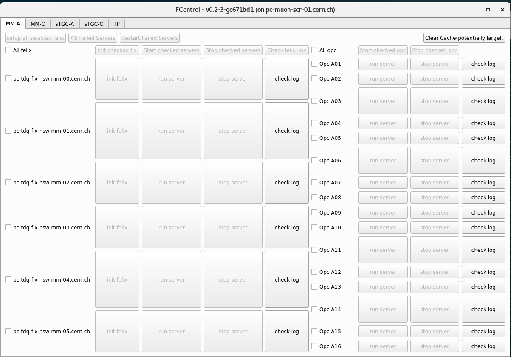

[[_TOC_]]

# FControl

FELIX control GUI @ P1, powered by [PyQt5](https://www.riverbankcomputing.com/software/pyqt/).

Everything is based on simple `ssh` to felix servers. This is because we don't have fancier tools. And there's no need for them.

# How to use

## Open @ P1
Login normally to any P1 machine that is not felix/swrod themselves, as FControl don't work normally there.

### stable version
```
/atlas-home/1/rowang/NSW/GUI/FControl/FControl
```
### nightly
```
/atlas-home/1/rowang/NSW/GUI/FControl/FControl_dev
```


## Demonstration
You'll see a window like below.


### select what to run
1. select the side/detector technology (you can run all simultaneously)
1. Check the felix server that you want to run.
1. Check the sector(OpcSca) server that you want to run.
   1. notice that checking on the sector that you want to run will check corresponding felix servers automatically.

### initialization 
1. Click the initialization button for felix server, this will run
   1. setup felix environment(for the `ssh` script).
   1. do `elinkconfig` and `flx-init` for all devices properly (effectively `/det/nsw/felix-configuration/nsw_felix_config.sh` for non-TP felix)
   1. do `/atlas-home/0/ptzanis/Documents/conf_l1ddc.sh` for non-TP felix

### run
1. Click the `run server` on corresponding felix/sector servers.
1. Stop the server by `stop server`.
1. You can check the log by `check log` button.
1. Exit the GUI by either clicking the `x`, or pressing `Ctrl+C` or `Ctrl+/` in the terminal

### Advanced:

1. The terminal will return you full command that you sent over `ssh`. 
